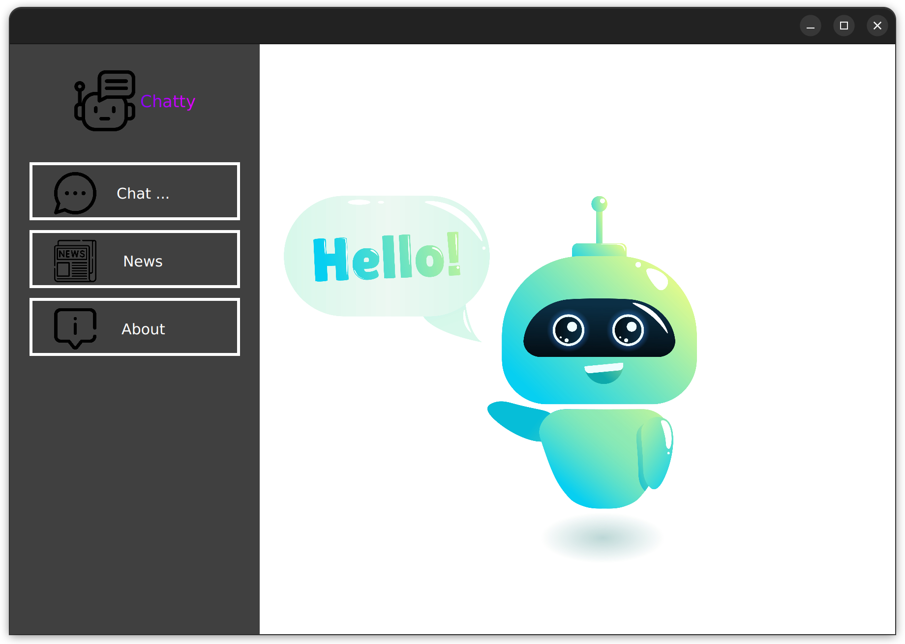
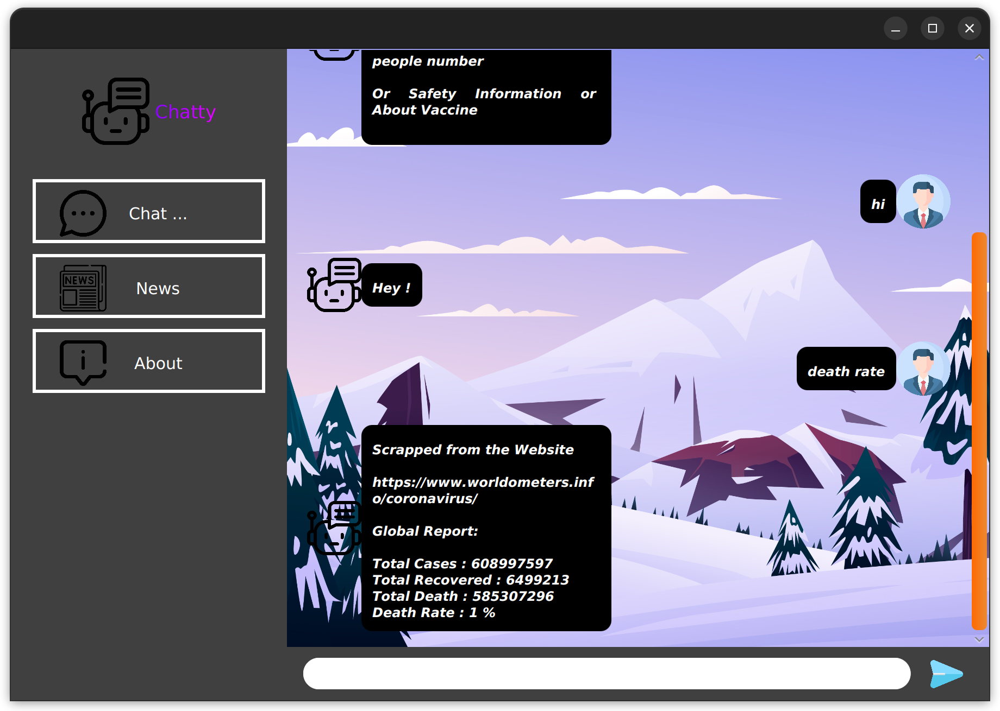
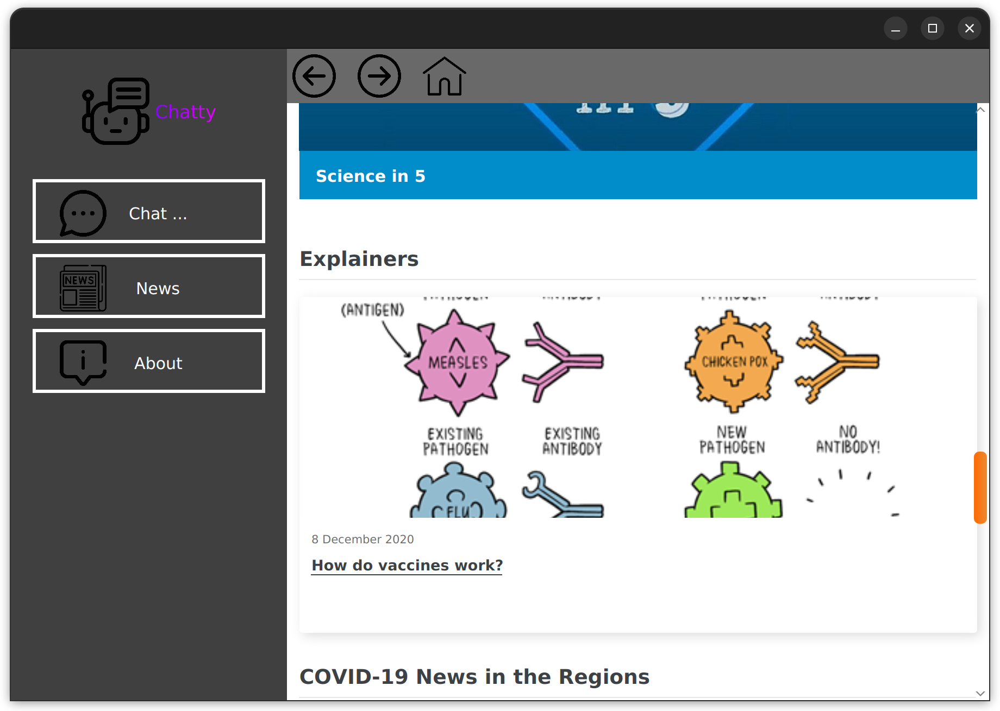

# Covid19 Based Chat-Bot (Chatty)
A javaFX-based dummy chatbot, which incorporates web-scraping to fetch information and some hardcoded replies (about covid).
 
This project was my first JavaFX application. The only goal of the project was to create a messaging app like interface and provide some functionality.

# Note
The **IntelliJ IDE** was used and the platform was **Ubuntu 22.04.1** while **updating the project**.
 
JDK Version : openjdk 18.0.2-ea

# Features
As said before, it is a dummy project. This doesn't have any useful functionality.
 
But the application implements **web-scraping** and **web-browser (provided by JavaFX)**.

# Demo
<h5>These screenshots describe some of the features of this application.</h5>
 
 
 
Home Screen.
 

 
 

 
A user is chatting with the application. (the reply is real-time data scraped from a website)
 

 
 

 
Browsing the WHO website from the application.
 

 
 

# Icons & Stock Images
<h5> Icons and stock images are downloaded from "www.freepik.com" & "www.flaticon.com". </h5>
